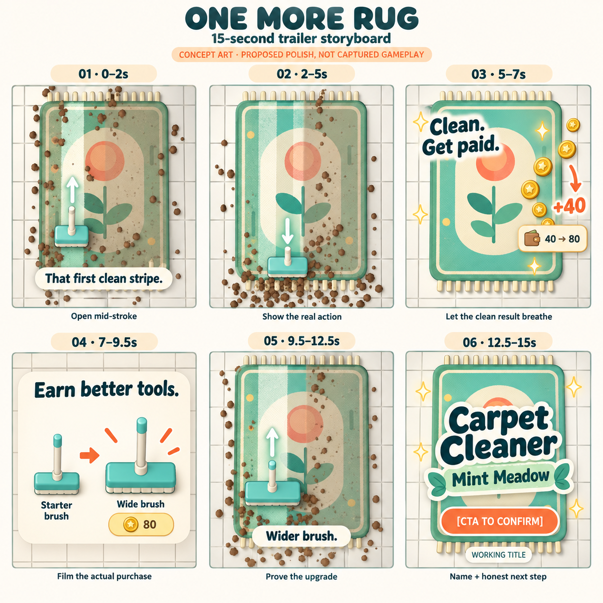

# Trailer storyboard v1 — One more rug

28 September 2026 · Creative proposal, grounded in the current project

Follow-up: [Designing the feeling](Satisfaction_Design_v1.md) develops the player motivation, audits deeper satisfaction gaps, and proposes a restoration/discovery variant of the middle. This original illustrated storyboard is retained for comparison.

The board is concept art, not captured gameplay. Panel proportions, illustrative purchase inset and oversized title communicate shot intent; final footage is 9:16 and uses the real purchase screen, placement-safe copy and a smaller title over continuing action. Generated with the built-in image tool from a current game reference; [exact art prompt](Storyboard_Art_Prompt.txt).

## The idea

**Make the viewer want to make the next clean stripe. Then show that cleaning earns a better tool.**

Lead with the tactile cleaning game; use the business layer to give that satisfaction somewhere to go. The working promise is **“Clean. Upgrade. Grow your shop.”** The first test audience is people who enjoy satisfying transformations, restoration, and light progression. That audience and this creative direction are hypotheses to test, not established results for this game.

The main 15-second ad follows one understandable chain: **mess → my action → visible improvement → finish → earned upgrade → more satisfying action**. A 25-second cut adds wet tools and a glimpse of another shop. Neither cut needs a studio introduction, narrated feature list, or complicated economics lesson.

This is a storyboard and development brief, not a finished trailer. Concept artwork shows the intended shots and proposed polish; the reference stills show the current build. Capture the finished ad from the actual playable game after the necessary changes land.

**Working title:** Carpet Cleaner • Mint Meadow, taken from the project. Public name and launch destination remain to be decided. Use a title placeholder in review cuts. “Download” belongs only on a version with a working store destination; a prelaunch version needs an actual follow/wishlist destination or simply “Coming soon.”

## 15-second master

Each shot must read in a small, muted phone preview. Keep the rug and tool large enough to see the effect of a single stroke. Copy is sparse; the action carries the message.

| Time | Picture and movement | On-screen copy | Sound direction | Why it is here / capture status |
| --- | --- | --- | --- | --- |
| **0.0–2.0** | Start mid-action, overhead and close enough to distinguish dirty from clean. A brush crosses the rug, leaving one vivid strip and pushing clumps ahead. The rest of the pattern is still muted by dirt. No opening fade. | **“That first clean stripe.”** | Immediate soft bristle scrape, a few light debris ticks. No music intro. | Earn attention with cause and effect. Brushing exists; stronger phone-readable contrast is proposed. The starter brush needs two passes, so show an honest second pass for the complete strip, or show partial improvement on the first. |
| **2.0–5.0** | Two satisfying adjacent passes. Cut forward to the final patch using the same camera and direction of motion. The pattern becomes readable. | No new copy. | Each pass has a matching texture; scrape softens as dirt disappears. | Establish the real interaction. Visible edits compress a job; do not imply that every rug takes five seconds. |
| **5.0–7.0** | Finish the final dirty patch. Let the clean rug sit unobstructed briefly, then let the real coins travel toward the wallet. Show a readable full-clean payout. | **“Clean. Get paid.”** | A short finish accent and restrained coin ticks. | Close the first loop. Coins and payout exist; a dedicated clean-rug hold is proposed. Use a second starter job: previous wallet 40, actual reward +40, wallet 80. |
| **7.0–9.5** | A fast, legible crop of the actual tool drawer: current brush → Wide brush, actual price 80, purchase. Match-cut to the new tool entering the work area. | **“Earn better tools.”** | One purchase click; tool arrival sound. | Connect work to a useful reward. Real first upgrade is 1.44× brush width, not a several-times-faster supertool. If the drawer cannot read at phone size, simplify its real presentation before filming. |
| **9.5–12.5** | The wider brush makes a visibly broader pass on the next rug, with the same pattern, angle and comparable stroke speed as the opening. Keep the tool and clean edge dominant. | **“Wider brush.”** | Fuller brush texture, still tied to contact. | Prove the upgrade through play. The actual first upgrade exists. Keeping the rug comparable makes the difference easier to judge; distinct patterns can earn their own shot in a later variant. |
| **12.5–15.0** | Hold or gently continue the satisfying pass under a compact name and one CTA. Leave the end card visible for the full interval. | **[Public game name]** + **[release-appropriate CTA]** | A light resolve while the last pass remains audible. | Convert interest into a clear next action. Do not cover the clean strip with a giant logo. Store badges/platform availability must match the actual release. |

**Editing rule:** keep the opening stroke continuous and at real playback speed. Later cuts may compress time visibly. Do not accelerate gameplay in a way that changes what the tool appears capable of doing. Any added camera move is an editorial crop, not a promised player camera control.

## 25-second cut

| Time | Beat | Additional information |
| --- | --- | --- |
| **0–2** | Same winning opening | Keep the hook identical while testing length. |
| **2–6** | More room for satisfying brush passes | Let one complete stroke play without a cut. |
| **6–9** | Finished rug and actual coin payout | Give the clean result breathing room. |
| **9–12** | Earn and buy the wider brush | Preserve the real price and wallet relationship. |
| **12–15** | Prove the wider sweep | Same framing and pattern make the upgrade easy to compare. A later variant can briefly show a different paid rug after the wider pass, once paid variety is implemented. |
| **15–19** | Hose wets the rug; cut to a squeegee pass pushing water over the edge | Copy: **“Unlock wet cleaning.”** Show the later-store context, not an apparent starter tool swap. Water and squeegee effects exist in production. Choose one clear edge-runoff event instead of a cluttered splash montage. |
| **19–22** | Brief actual home/store change | Copy: **“Grow your shop.”** Show only implemented store progression. Current buildings share geometry and change palette; remove this beat if it reads too weakly, giving its time back to wet cleaning. |
| **22–25** | Title and CTA over a clean rug | Match the destination and the store-page visual promise. |

An optional **6–10-second Stories cut** can later use hook → satisfying finish → title/CTA. It is an editing experiment, not a reason to add more features now.

## Three openings to test

Keep the same 2–15-second middle and ending, same audience, destination, and offer. Change only the first two seconds and associated hook text.

1. **Satisfaction, recommended baseline:** begin with a perfectly readable clean strip. “That first clean stripe.” The product explains itself immediately.
2. **Discovery:** begin with the pattern obscured, then expose its recognizable central motif. “What’s under the dirt?” Run this only after real dirt contrast makes discovery true. Reveal enough in the opening to reward curiosity; do not withhold the entire payoff.
3. **Completion:** begin with a nearly clean rug and one obvious dirty patch. “One spot left.” Connect the following montage with a clear cut to another job so the chronology makes sense. Test whether completing a small visible goal interests viewers more than the transformation.

These are creative hypotheses. There is no evidence yet that mystery, ASMR, or completion will be the winning hook for this particular game.

## The loop the game needs to deliver

| Loop | Player experience | Design implication |
| --- | --- | --- |
| **During a stroke** | “My hand did that.” | Low-latency control, a clean boundary, dirt moving in the stroke direction, sound only when meaningful contact happens. |
| **During a rug** | “I can finish this.” | Readable remaining dirt and progress, satisfying edges, no hunt for invisible residual pixels. Keep the existing early-finish choice understandable. |
| **Between rugs** | “I earned something useful.” | Show the payout, then an affordable next choice. Demonstrate the tool improvement immediately on a new job. |
| **Across a session** | “I want to see the next rug / tool.” | Real pattern variety and tools that change the feel of cleaning. Wet tools offer a new action, rather than just a bigger number. |
| **Across returns** | “My shop is progressing.” | Legible store goals and existing Bonzi income. The ad does not need to teach offline caps or every upgrade condition. |

This is a motivation loop built around competence, choice, and visible results. The cited research supports those design principles; it does not prove retention for this game. Do not replace the satisfying action with arbitrary timers, manufactured failure, or rewards unrelated to play. The most persuasive version is the one new players actually experience.

## What exists, and what we should build first

P0 means necessary for the recommended production cut or its truthful first-session experience. P1 strengthens the idea and can be staged after a capture-now prototype. These priorities are creative judgments, not measured uplift estimates.

| Priority | Change | Current evidence | Acceptance criterion |
| --- | --- | --- | --- |
| **P0** | **Make dirty → clean contrast unmistakable** | The current shader intentionally lets the pattern show through pale dust; dust strength defaults to 0.58. | A muted, phone-size first-two-second preview makes the cleaned region obvious without an arrow or explanation. Preserve the actual two-pass starter behavior unless deliberately retuned in the game. Try contrast and dirt hue first; do not bury everything in extra particles. |
| **P0** | **Add responsive cleaning audio** | No cleaning audio or haptic implementation/assets were found in the source audit. | Brush contact, water contact, extraction, completion and coins each have restrained, synchronized feedback; no scraping on empty floor or dry squeegee passes. Include a usable sound toggle. Optional haptics are a separate device-tested enhancement, not a prerequisite for a muted ad. |
| **P0** | **Give the clean result a readable finish beat** | Existing completion begins suction and departure; there is no dedicated hero hold. | The rug is visible clean and unobscured for an initial target of about 0.5–0.8 seconds before departure. Tune through playtesting, allow continuing smoothly, and retain Back responsiveness and reliable reward saving. Show the true full-clean payout. |
| **P0** | **Teach the advertised loop in the first session** | Brush instruction is a no-op; first-use payout teaching remains unfinished. | A new player can enter cleaning, make a meaningful stroke, understand a completed job, and find the earned tool upgrade with minimal prompts. Playtest elapsed time to these milestones; no timing claim is established yet. |
| **P0 for wet-led ads only** | **Make an early wet trial real, or keep the brush-led opening** | Wet tools first appear in Store 2 after upgrade, job, Bonzi and wallet gates. Exact time-to-unlock is unmeasured. | The recommended brush-led cut needs no unlock change. If a wet-led variant wins testing, add a clearly framed real first-session wet job/trial, or an equally clear early path to it, before scaling that promise. Existing Gym access is not an onboarding flow. |
| **P1** | **Put multiple authored rugs into paid jobs** | Three resources exist, but production always selects rug 0; alternate designs cycle only in practice. | At least three visually distinct paid-job designs appear predictably enough to demonstrate; save/resume preserves the chosen rug and its progress. Patterns must remain attractive under both dirt and wetness. No mystery collection UI is necessary for v1. |
| **P1** | **Make the first tool purchase read at a glance** | A real comparison drawer and 1.44× width upgrade already exist. | Film the actual drawer, then prove the change on the same-size rug at comparable stroke speed. If it does not read, improve the real offer layout and tool presentation rather than inventing a bigger footprint in the ad. |
| **P1, only for the growth beat** | **Give store expansion a distinctive visual payoff** | Four stores exist but share the building geometry with palette changes. | One recognizable silhouette, sign, or environment difference communicates a new location in a short shot. This is optional for the first 15-second ad; do not let a full environment rebuild delay proving the cleaning hook. |
| **Before spending on installs** | **Verify real phone feel and the destination** | Android debug export exists; device performance and touch feel are unmeasured in the project coverage. Public listing is not verified. | Test representative target phones, native touch, audio sync and 9:16 composition; use the real store link and correct name. Choose stable capture settings based on the device result. |

**Smallest useful build sequence:** contrast + contact audio → clean finish/payout beat → first-session teaching and obvious tool purchase → paid rug variety. Capture and review the 15-second cut here. Improve wet access or store art only if those shots earn their place in testing.

## Capture and editing plan

- Produce a **1080 × 1920, 9:16** master. This is our production choice, not a claim that it is the only accepted specification. Record a stable 30 or 60 fps only after checking the target device; retain the native gameplay speed.
- Start with a tighter gameplay crop that keeps the tool, remaining dirt and revealed pattern readable. The finished master must not merely stretch the current 720 × 1000 viewport. Check the actual portrait layout/camera at the output aspect ratio.
- Keep critical text, the tool head, the clean edge and CTA out of placement overlays. Use the current official safe-zone template and actual ad preview for each platform, caption and CTA; there is no universal pixel rectangle covering all combinations.
- Capture clean source footage without social-platform chrome. Add only a few short editorial text overlays. View every cut muted before reviewing sound. Sound adds pleasure, but the picture explains the action.
- For the 15-second reward scene, use two genuine starter full cleans at the unchanged balance: 40 + 40 funds the 80-coin brush. The footage may begin during the second rug. Do not imply a single +40 reward purchases an 80-coin item from an empty wallet.
- Use isolated test saves and reproducible shot states. Keep any scripted capture setup separate from gameplay. The reference captures in this folder are staged stills, not proof of job duration, device performance, or an unbroken player session.
- In later development, a small capture mode could provide fixed scatter, repeatable input paths, a clean HUD option, and shot markers. This is production tooling, not a new game feature. It must not inflate cleaning strength or generate payouts the real game cannot earn.
- Build sound from owned/licensed game audio; check music rights for both placements before adding music. A soft rhythm is optional. Keep cleaning sounds in front and avoid covering each swipe with narration.
- Save a hook-only comparison, the 15-second master, the 25-second expansion, and platform-specific exports. Select the hook before testing length so results remain interpretable.

## How we will judge the ad

1. **Comprehension before spend:** show a muted two-second crop and the full cut to a few people unfamiliar with the game. Ask what they think they do, what changed, and what they would expect after installing. This is a qualitative check, not statistically powered research.
2. **Hook test:** compare opening variants with a fixed body/end. Use platform experimentation tools where available; confirm their supported number of arms, and use pairwise tests for finalists. Do not simultaneously change audience, music, gameplay, offer and runtime.
3. **Follow the whole funnel:** platform-defined early viewing/hold and completion; destination clicks; installs; first paid rug completed; first earned tool purchased; next-day and seven-day return. Compare definitions within a platform before comparing results across platforms.
4. **Choose for useful players:** define an activated player before testing, provisionally “completed a paid rug and bought an earned tool within the first 24 hours.” Track cost per activated player alongside install cost and retention. Keep first-rug completion as a separate early diagnostic because tool pacing may still change.
5. **Decision rule:** an opening that gets views but weak activation may be entertaining or misleading about the experience. A good click rate cannot settle that question. Inspect the first-session drop-off before adding features or increasing spend. Do not pick a winner from a few installs; predefine sample needs from the eventual baseline, budget and meaningful effect size.

Analytics events above are proposed instrumentation, not a claim that an analytics SDK is installed. Budget, acquisition baseline and release plan are not yet supplied, so there is no defensible numerical performance forecast or fixed test spend in this brief.

## Source evidence in the project

- `CarpetToy/scripts/workshop.gd:349–359`: brush footprint/strength; `:418–441`: paid wet feedback; `:646–648`: instruction no-op; `:674–675` and `:927–938`: production rug restriction and practice-only cycling; `:713–744`, `:892–947`: completion flow.
- `CarpetToy/scripts/progression.gd:4–16`: four stores, prices, widths and wet-tool entry. First brush upgrade costs 80 and changes width from 1.0 to 1.44.
- `CarpetToy/scripts/shop_state.gd:13–15`, `:597–603`: completion thresholds/rewards; `:695–709`: travel requirements; `:806–826`: passive income.
- `CarpetToy/scripts/cleaning_hud.gd:336–357`: coins into the wallet.
- `CarpetToy/scripts/soil_surface.gdshader:11–13`, `:48–52`: pale dust and retained visible pattern.
- `CarpetToy/scripts/floating_home.gd:245–250`: store palette changes. `design/Implementation_Coverage.md:33–37`: device, balance, provider and polish limits.
- Source audit found no `AudioStream`, `AudioServer`, `vibrate_handheld` implementation or sound assets in active scripts/scenes/resources. This is a source finding, not a listening or device test.

### Visual inspection

Eight production-scene reference stills were rendered at 720 × 1280 with Godot 4.7.2 stable Mono and `--shop-test`, then inspected. They confirm that the squeegee's bright cleared-channel ridge against the dark wet rug creates the strongest current transformation. Dry brushing has a subtler dust boundary and can leave many clumps around the edge; the percentage requires both surface and debris clearance. The first-session feedback should make that remaining work understandable. A large visual stripe alone is not proof of a nearly finished job.

The capture fixture seeds coins and later-store access for inspection; the manifest describes each setup. These screenshots are references, not final ad frames. The full-size current-build stills are under [references](references/capture_manifest.json). A maximum Store 1 brush reference must not be used as the advertised first 80-coin upgrade.

| Current-build reference | What it establishes |
| --- | --- |
| [Home](references/01_home.png) | Actual current building, branding and management dock. |
| [Dirty starter rug](references/02_dirty_starter.png) | Actual initial dust contrast and tool. |
| [Brushed stripe](references/03_brushed_stripe.png) | Real brush-path result after several staged passes; debris clearance still matters. |
| [First upgrade](references/04_first_upgrade.png) | Real 80-coin purchase and 1.44× width, seeded wallet 80 → 0. |
| [Maximum Store 1 brush](references/04_upgraded_brush.png) | Later tool visual reference only. |
| [Hose](references/05_hose.png) | Actual later-store wetting effect in a seeded fixture. |
| [Squeegee](references/06_squeegee.png) | Actual wet/extracted contrast and runoff effect on a pre-wetted fixture. |
| [Clean rug](references/07_clean_rug_fixture.png) | Clean art target with masks cleared and tool hidden; no real completion or payout occurred in this fixture. |

## Research informing the brief

Checked 28 September 2026. Platform guidance is advice, not a guarantee of results. The lengths above are starting experiments, not technical maximums.

1. [TikTok creative best practices](https://ads.tiktok.com/resources/help/article/creative-best-practices): early proposition/hook, vertical framing, sound and safe-zone awareness.
2. [TikTok hyper-casual game creative guidance](https://ads.tiktok.com/business/creativecenter/quicktok/online/tiktok-hyper-casual-game-creative-tips/pc/en): gameplay attractions, progress comparisons and satisfaction from organizing chaos. Our application to rug cleaning is an inference.
3. [TikTok auction in-feed specifications](https://ads.tiktok.com/help/article/tiktok-auction-in-feed-ads?Tag=Page%2520Titles&redirected=2): current safe zones depend on dimensions, caption and added formats/anchors; use the matching template.
4. [Meta Reels ads guidance](https://www.facebook.com/business/ads/facebook-instagram-reels-ads): 9:16, audio, safe-zone placement and testing. Detailed help/spec pages were login-blocked during research; exact pixel margins are not independently verified here.
5. [TikTok split-testing variables](https://ads.tiktok.com/help/article/split-testing-variables?lang=en): supports testing initial two-to-three-second hooks and keeping to one variable.
6. [TikTok App Event Optimization](https://ads.tiktok.com/resources/help/article/app-event-optimization): supports optimization beyond installs, including a game level achievement event. Our activation definition is a proposed business metric, not a preinstalled event.
7. [Ryan, Rigby & Przybylski, 2006](https://selfdeterminationtheory.org/SDT/documents/2006_RyanRigbyPrzybylski_MandE.pdf): perceived competence and autonomy relate to enjoyment and future play in the authors’ studies. This is a design foundation, not an estimate of our ad or retention performance.
8. [Kao et al., CHI 2024](https://people.csail.mit.edu/dkao/pdf/3613904.3642656.pdf): a preregistered experiment on game feedback found motivation benefits from success-dependent feedback, while amplification alone did not produce the expected benefit. Our implication is to tie effects to real cleaning and completion, rather than merely increasing visual noise.

## Decisions for the next iteration

Confirm the public name and launch destination; review whether the clean-stripe opening feels compelling; then implement the small first build sequence above. The wet-led version and distinct-store artwork remain optional until they show a reason to expand scope.
